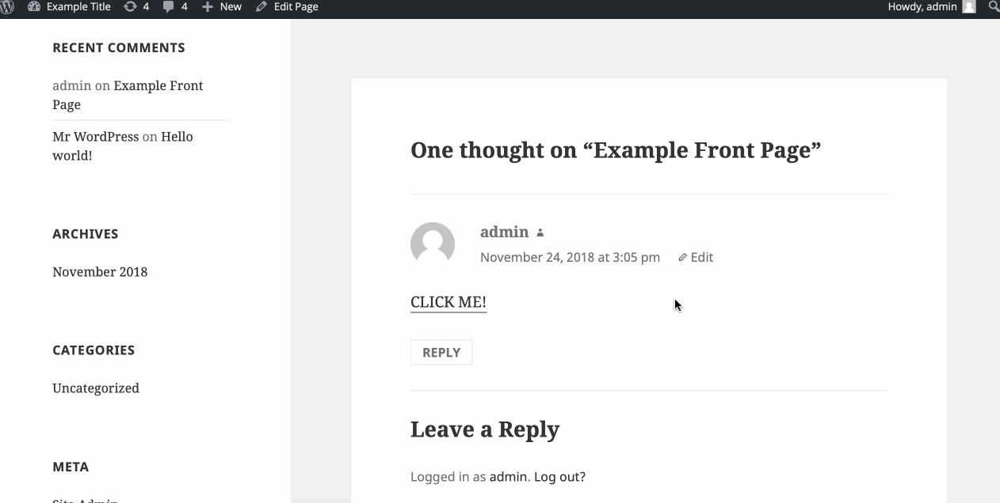
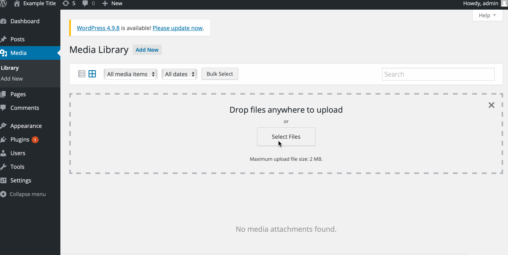
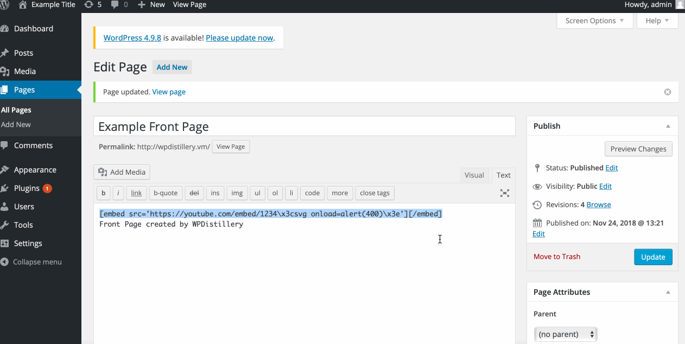
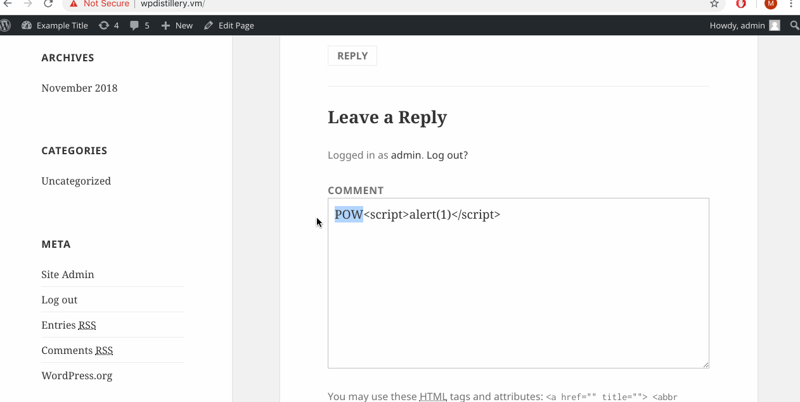

# Web-Security-Week7
# Project 7 - WordPress Pentesting

Time spent: **11** hours spent in total

> Objective: Find, analyze, recreate, and document **five vulnerabilities** affecting an old version of WordPress

## Pentesting Report

1. (Required) Vulnerability Name or ID: Authenticated Stored Cross-site scripting
  - [x] Summary:
    - Vulnerability types: XSS
    - Tested in version: 4.2
    - Fixed in version: 4.6.1
  - [x] GIF Walkthrough:
    - 
  - [x] Steps to recreate: Create a new post and insert code in text: ```<a onmouseover= "alert(1)" >click here</a>```.
        Click "Preview" and the post you intend to post appears. When the cursor hovers over the click here link, the alert pops up.
  - [x] Affected source code:
    - [Link 1](https://core.trac.wordpress.org/browser/branches/4.2/src/wp-includes/class-wp-editor.php?rev=33361)
2. (Required) Vulnerability Name or ID
  - [x] Summary:
    - Vulnerability types:
    - Tested in version: 4.2
    - Fixed in version: 4.7.5
  - [x] GIF Walkthrough:
    - 
  - [x] Steps to recreate: Go to the login page of WordPress and first check for admin with no password, which leads to the empty password field.
        Next, check for admin but with an incorrect password, resulting to incorrect password for admin to display.
        Then, when we write in a random username and password, it shows error that username doesn't exist.
  - [x] Affected source code:
    - [Link 2](https://www.wpwhitesecurity.com/wordpress-security/wordpress-username-disclosure-vulnerability/)
3. (Required) Vulnerability Name or ID: Authenticated Stored Cross-Site Scripting via Image Filename
  - [x] Summary:
    - Vulnerability types:
    - Tested in version: 4.2
    - Fixed in version:
  - [x] GIF Walkthrough:
    - 
    - [X] Steps to recreate: Upload an new image and update the title name to ```filename.png```. Then view attachment page which should then bring up an onerror message.
    - [X] Affected source code:
      - [Wordpress v4.2](https://core.trac.wordpress.org/browser/branches/4.2/src/wp-admin/includes/media.php)
4. (Optional) Vulnerability Name or ID: Stored XSS through embedded URL
  - [x] Summary:
    - Vulnerability types:
    - Tested in version: 4.2
    - Fixed in version: 4.2.13
  - [x] GIF Walkthrough:
      - 
  - [x] Steps to recreate:
    - Create a page containing a harmful embedded link; for instance:``` " [embed src='https://youtube.com/embed/123\x3csvg onload=alert(400)\x3e'][/embed] " ``` So when you public/ preview the page the alert will appear.
  - [x] Affected source code:
    - [Link 4](https://github.com/WordPress/WordPress/commit/419c8d97ce8df7d5004ee0b566bc5e095f0a6ca8)
    - [x] Extra GIF Walkthrough:
      - 

## Assets

List any additional assets, such as scripts or files

## Resources

- [WordPress Source Browser](https://core.trac.wordpress.org/browser/)
- [WordPress Developer Reference](https://developer.wordpress.org/reference/)

GIFs created with [LiceCap](http://www.cockos.com/licecap/).

## Notes

Describe any challenges encountered while doing the work

## License

    Copyright [2018] [Martin Li]

    Licensed under the Apache License, Version 2.0 (the "License");
    you may not use this file except in compliance with the License.
    You may obtain a copy of the License at

        http://www.apache.org/licenses/LICENSE-2.0

    Unless required by applicable law or agreed to in writing, software
    distributed under the License is distributed on an "AS IS" BASIS,
    WITHOUT WARRANTIES OR CONDITIONS OF ANY KIND, either express or implied.
    See the License for the specific language governing permissions and
    limitations under the License.
